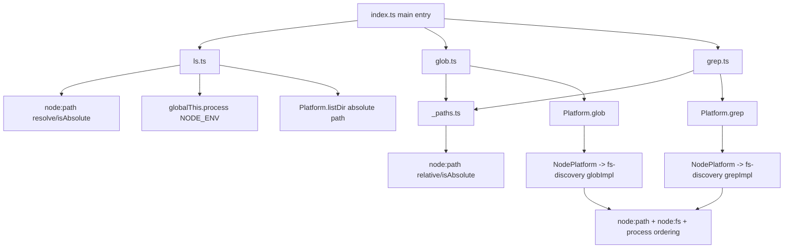
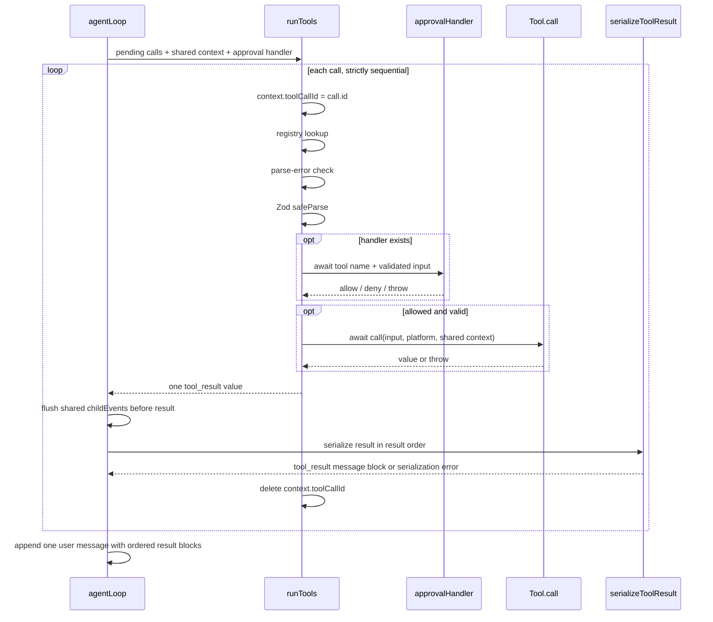

# Core Runtime Hardening Research

**Date:** 2026-07-13
**Scope:** `feature/core-runtime-hardening`
**Phase:** research
**Evidence base:** repository at `feature/core-runtime-hardening`, approved framing, binding project/feature decisions, current source/tests, and primary external documentation.

## 1. Research questions

1. What stop-reason vocabulary is normalized today for Anthropic and OpenAI, where is it discarded, and which public types, consumers, tests, and examples would be affected by preserving it as a typed terminal outcome?
2. How do established APIs and agent runtimes represent token exhaustion, filtering, refusal, and other abnormal-but-valid completions without conflating them with transport/runtime exceptions?
3. Where do Node path/process dependencies currently escape the `Platform` boundary, what behavior do those dependencies provide, and what are the smallest credible portable seams for path resolution, return-path formatting, basename handling, and deterministic ordering?
4. What is the current validation → approval → execution → serialization flow for tool calls, and where can contiguous read-only calls overlap without changing result order, unsafe barriers, error isolation, cancellation, or per-call attribution?
5. Which built-ins are objectively read-only under their current contracts, which are currently marked safe, and what input-, platform-, or cancellation-dependent caveats remain?
6. Why is `task` not safe to include in this concurrency feature, based on the implemented child-event, usage, cancellation, and context plumbing?
7. Which code, tests, examples, comments, docs, changelog entries, and version metadata are stale or necessarily affected by the four locked stages?
8. Does the approved work remain one coherent feature, and is there any hard constraint or unresolved fork that requires user direction before engineering?

## 2. Executive evidence summary

1. **Stop reasons are normalized at both provider adapters and then discarded in the loop.** Anthropic caches the raw `stop_reason`; OpenAI maps `stop → end_turn`, `tool_calls → tool_use`, and `length → max_tokens`, while passing other strings such as `content_filter` through. `agentLoop` reads only `message_stop.usage`, decides continuation from the presence of buffered tool calls, and emits every tool-free valid provider completion as `agent_done`. Thus `max_tokens`, filtering, refusal-like, stop-sequence, and unknown valid outcomes become indistinguishable from natural completion. Partial text, messages, and usage are already retained on this path; the missing datum is the reason.
2. **The present provider reason type is not meaningfully closed.** `"end_turn" | "tool_use" | "max_tokens" | string` simplifies to `string`, so consumers receive no exhaustive vocabulary. Current Anthropic documentation has expanded beyond the three named values to include `stop_sequence`, `pause_turn`, `refusal`, and `model_context_window_exceeded`; OpenAI additionally documents `content_filter` and legacy `function_call`. A compatibility strategy for unknown future/vendor-compatible strings is therefore load-bearing.
3. **Valid stop outcomes are not errors in provider APIs.** Anthropic explicitly returns stop reasons in HTTP 200 responses and distinguishes them from 4xx/5xx failures. OpenAI returns `finish_reason` on successful choices. Vercel AI SDK uses a normalized finish-reason union with categories such as stop, length, content-filter, tool-calls, error, and other; LangChain retains provider finish data in response metadata rather than promoting it to an agent exception. This supports the locked separation between typed terminal outcomes and `agent_error`.
4. **The strict portability promise is currently violated by the main public module graph.** `ls.ts` imports `node:path` and reads `globalThis.process`; `_paths.ts`, statically imported by `glob.ts` and `grep.ts`, imports `node:path`. Because all four discovery tools are re-exported from the main `index.ts`, a browser/custom-platform consumer reaches Node imports without importing `platform/node`. The lint rule neither bans `node:path` nor catches `globalThis.process`, and it exempts all of `platform/**` from every core restriction, not only Node restrictions.
5. **Path and ordering responsibilities are split inconsistently.** `ls` resolves relative paths and sorts in the model-facing tool; `glob`/`grep` resolve and sort in Node-platform code; `_paths.ts` formats results with host Node semantics regardless of the injected platform. Existing behavior can be preserved through several credible seams, but each has a different public `Platform` blast radius and path-semantics commitment.
6. **The concurrency hook exists, but only three of the four locked safe tools declare it.** `ls`, `glob`, and `grep` return `true`; `read_file` is read-only but has no `isConcurrencySafe` marker. `write_file`, `edit_file`, `bash`, and `task` are unmarked. The discovery implementations keep traversal/regex/ignore state inside each invocation, so no shared mutable state was found among the four intended safe tools.
7. **`runTools` is currently total per call but relies on shared mutable attribution.** It performs lookup → parse-error handling → Zod validation → approval → `tool.call`, catches each call failure into a `tool_result`, and mutates one shared `context.toolCallId`. `loop.ts` also installs one shared child-event buffer and usage sink around the whole runTools pass. Parallel execution therefore requires per-call context/attribution isolation even though `task` is excluded.
8. **Ordered aggregation is straightforward, but scheduling semantics are not automatic.** Both `Promise.all` and `Promise.allSettled` preserve input order; `Promise.all` rejects on the first rejection, whereas `allSettled` waits for every call. Current `runTools` converts expected per-call failures to values, but a defensive batch implementation still must ensure every started call settles, especially under cancellation and unexpected helper failures.
9. **Cancellation is only partially cooperative today.** Every call receives `context.signal`, but `glob` and `grep` are the only intended safe tools that forward/check it. `read_file` and `ls` cannot interrupt an in-flight platform operation under the current signatures. `runTools` itself has no pre-call aborted-signal guard. Therefore “signal every active call” is feasible immediately; “promptly stop every active filesystem operation” is not guaranteed without a contract change.
10. **Docs and metadata are materially stale.** The core README still says there is no approval flow or sub-agent support, lists only two built-ins, calls `ToolCallContext` empty, documents only four Platform methods, omits reasoning/usage/cancellation, and says all tools are sequential. `STATUS.md`, `core-roadmap.md`, `CHANGELOG.md`, and several source comments similarly describe shipped work as future M1/M2 work. Package version remains `0.1.0`; selecting the next version is release-policy work, not a research conclusion.

## 3. Locked decisions versus unresolved implementation questions

The following are **already locked** and are not open architecture/product forks:

| Locked input | Evidence |
|---|---|
| One ordered feature: stop reasons → portability → safe FS concurrency → docs/release readiness | Feature decisions, 2026-07-11 |
| Valid provider stops are typed terminal outcomes, not `agent_error`; preserve partial output/messages/usage | Feature decisions and approved design §§2.1, 5 |
| Model-facing built-ins may not import Node APIs or process state; lint must enforce it | Feature decisions and approved design §2.2 |
| Initial safe set is `read_file`, `ls`, `glob`, `grep` | Feature decisions and approved design §2.3 |
| `write_file`, `edit_file`, `bash`, `task`, unknown/invalid/denied/unmarked calls are sequential barriers unless engineering proves an equivalent-safe treatment | Approved design §§2.3, 4.3 |
| Safe calls form maximal contiguous batches, unsafe barriers wait, and results remain in model call order | Approved design §§2.3, 4.3 |
| Concurrent `task` calls and child-event/usage redesign are out of scope | Feature decisions and approved design §3 |
| No tag, publish, or GitHub release | Feature decisions and approved design §2.4 |

Engineering still has to define the exact type vocabulary, portable seam, preflight/classification schedule, context isolation mechanism, cancellation guard, and release metadata value. Those are implementation questions within the locked framing, not reasons to reopen scope.

## 4. Current-state execution and data-flow maps

### 4.1 Stop-reason flow

```mermaid
flowchart TD
  A[Anthropic message_delta.stop_reason] --> B[InputAccumulator.stopReason: string]
  B --> C[ProviderEvent message_stop.stopReason]
  D[OpenAI choices[0].finish_reason] --> E[mapFinishReason]
  E -->|stop| F[end_turn]
  E -->|tool_calls| G[tool_use]
  E -->|length| H[max_tokens]
  E -->|other string| I[pass through]
  F --> C
  G --> C
  H --> C
  I --> C
  C --> J[agentLoop message_stop branch]
  J -->|reads| K[usage only]
  J -->|drops| L[stopReason]
  M[buffered tool_use count > 0] --> N[runTools and continue]
  O[buffered tool_use count = 0] --> P[turn_complete]
  P --> Q[agent_done event]
  Q --> R[Terminal reason: agent_done]
```

**Exact loss point.** In `packages/core/src/loop/loop.ts:73-77`, the `message_stop` branch copies only `event.usage`; no local stop-reason variable exists. At `loop.ts:113-208`, `pendingToolUses.length` alone selects continuation versus `agent_done`.

**What is already preserved.** Text deltas are accumulated into the assistant message; usage is accumulated before terminal construction; tool-free partial output is therefore present in final `messages` and `usage`. Empty tool-free outputs are intentionally not appended as invalid empty assistant content. Adding stop-reason propagation does not require turning partial outputs into exceptions.

**Current normalized vocabulary.** Runtime values are:

| Source | Provider-native value | Current canonical value |
|---|---|---|
| Anthropic | any string received as `stop_reason` | passed through unchanged; defaults to `end_turn` if absent |
| OpenAI | `stop` | `end_turn` |
| OpenAI | `tool_calls` | `tool_use` |
| OpenAI | `length` | `max_tokens` |
| OpenAI | `content_filter` | passed through as `content_filter` |
| OpenAI | deprecated `function_call` or any unknown compatible-endpoint value | passed through unchanged |
| OpenAI stream with no observed finish reason | defaults to `end_turn` at flush |

The static type names three values but includes `string`, so it is effectively untyped. OpenAI’s separate streamed/message `refusal` data is not read by the mapper; a response whose finish reason does not itself identify refusal cannot currently be normalized as refusal.

**Behavioral mismatch today.** A provider `message_stop` with `max_tokens`, `content_filter`, `stop_sequence`, `refusal`, or an unknown string and no buffered tool call emits `agent_done`. Tests cover provider mapping for `max_tokens` and `content_filter`, but no loop test proves these reasons survive to terminal events because they do not.

### 4.2 Portability/path/ordering flow



**Current division of responsibility.**

| Concern | `ls` | `glob` | `grep` |
|---|---|---|---|
| Relative input resolution | Tool uses host `node:path` against `platform.cwd()` | `NodePlatform`/`globImpl` resolves `options.cwd` | `NodePlatform`/`grepImpl` resolves `options.path` |
| Returned-path formatting | Basenames already returned by `listDir` | Tool `_paths.ts` uses host `node:path.relative/isAbsolute` | Tool `_paths.ts` uses host `node:path.relative/isAbsolute` |
| Basename | `Platform.listDir` entries already basename; `NodePlatform.stat` uses `node:path.basename` | N/A in tool | N/A in tool |
| Ordering | Tool sorts mtime-desc or name-asc under `globalThis.process.env.NODE_ENV === test` | Platform helper sorts mtime-desc or name-asc under `process.env.NODE_ENV === test` | Platform helper sorts mtime-desc or name-asc under `process.env.NODE_ENV === test` |

**Why this is not only a lint issue.** Static re-exports from `index.ts` make Node path imports part of the main package graph. A custom platform cannot choose Windows, POSIX, URL-like, or virtual-filesystem path semantics for `ls`/return formatting because the host Node runtime decides them first.

**Lint gaps.** The current core override:

- bans several `fs`/`child_process` spellings, but not `path`, `node:path`, `util`, `node:util`, or a general `node:*` pattern;
- bans the bare global `process`, but `globalThis.process` bypasses that rule;
- ignores `packages/core/src/platform/**` from the entire override, which also removes the UI/upward-dependency restrictions there;
- has messages that still say only `platform/node.ts` is allowed although `platform/fs-discovery.ts` is also intentionally Node-specific.

### 4.3 Tool execution and safe-batch flow today



**Current deterministic semantics.** Lookup, parse handling, validation, approval, execution, event yield, and serialization all happen one call at a time in model order. Unknown tools, malformed input, invalid input, denials, approval failures, tool throws, and serialization failures become call-specific error results; they do not abort later calls.

**Current shared attribution state.** `context` is one mutable object per run. `runTools` writes/deletes `toolCallId`; `loop.ts` temporarily adds `reportUsage` and `emitEvent`; `loop.ts` has one `childEvents` array reset as sequential results arrive. This is safe only because calls do not overlap.

**Current cancellation.** `context.signal` is present on every call. `glob` and `grep` forward it into Platform options, and the shared walk checks it between entries/files. `read_file` has no signal-bearing `Platform.readFile` contract. `ls` does not inspect the signal and `Platform.listDir` has no signal option. There is no `signal.aborted` guard in `runTools` before starting the next call.

### 4.4 Why `task` is excluded

`task` drives a nested async generator while one `Tool.call` is awaited. It emits sanitized child events through `context.emitEvent`, reports usage through `context.reportUsage`, relies on `context.toolCallId` for `taskId`, and passes the parent signal/depth into the child. The loop currently buffers all child events in one mutable array and folds all reported usage from one batch later. Concurrent task calls would therefore require per-call event sinks, usage buckets, child cancellation ownership, result-to-child correlation, and a decision about real-time versus ordered buffered forwarding. The known break-cancellation limitation also means consumer `break` cannot interrupt an already-awaited child; only the external signal does. These are exactly the redesigns excluded by the approved scope.

## 5. Prior art and existing solutions

### 5.1 Stop-reason modeling

| Prior art | What it does well | What is missing/different for this project | Evidence to borrow or avoid |
|---|---|---|---|
| Anthropic Messages API | Treats `end_turn`, `max_tokens`, `stop_sequence`, `tool_use`, `pause_turn`, `refusal`, and `model_context_window_exceeded` as successful-response stop reasons; gives reason-specific handling guidance. | Provider-specific and evolving; `pause_turn` carries continuation semantics that tiny-agentic does not currently implement. | Borrow the error/outcome distinction and preserve reason. Avoid assuming the historical three-value set is complete. |
| OpenAI Chat Completions | Emits `finish_reason` values including `stop`, `length`, `tool_calls`, `content_filter`, and deprecated `function_call`; exposes refusal separately on messages. | `stop` can cover natural stop or a supplied stop sequence, so it cannot always map losslessly to Anthropic’s distinction. Refusal may require mapping data beyond `finish_reason`. | Keep an explicit normalization table and test native-to-canonical equivalence. Avoid inferring refusal solely from empty text. |
| Vercel AI SDK | Uses a closed, provider-neutral `FinishReason` vocabulary including `stop`, `length`, `content-filter`, `tool-calls`, `error`, and `other`; higher-level generation APIs expose the finish reason with the result. | Its inclusion of `error` in finish reason differs from tiny-agentic’s locked `agent_error` separation; exact raw-provider preservation must be checked in the chosen version. | A closed union plus an `other`/raw escape hatch is established practice. Do not copy its error category if it violates the locked terminal contract. |
| LangChain JS | Keeps provider response metadata, including stop/finish data, attached to the AI message. | It does not provide a single normalized agent-level finish reason in the cited message contract, so consumers inspect provider-specific keys. | Demonstrates the compatibility value of preserving raw metadata, but tiny-agentic’s multi-provider goal needs stronger normalization than this approach alone. |

### 5.2 Ordered concurrent aggregation

- `Promise.all` starts from an iterable of promises and fulfills with values in input order regardless of completion order. It rejects as soon as any input rejects.
- `Promise.allSettled` waits for every input and returns settlement records in input order.
- Since current `runTools` already catches ordinary tool failures and turns them into values, either primitive can preserve ordered results if the per-call helper is total. `allSettled` provides an additional defensive boundary against unexpected helper rejection and directly matches the locked “all started calls settle” requirement, at the cost of one more normalization step.
- Neither primitive supplies unsafe barriers, validation/approval ordering, cancellation, concurrency limits, or context isolation. Those remain scheduler responsibilities.

### 5.3 Portable path abstraction patterns

| Pattern | Evidence/maturity | Advantages here | Limitations/blast radius |
|---|---|---|---|
| Capability injection (`Platform` path methods or a `Path` service) | Effect Platform exposes injectable `basename`, `relative`, `resolve`, and other path operations, with a cross-environment POSIX implementation. The project already uses capability injection. | Lets each custom platform own path semantics; aligns with the locked boundary; can preserve Node host semantics in `NodePlatform`. | Adding required methods breaks every external `Platform` implementor; a broad path API would exceed the “smallest coherent contract” constraint. |
| Small portable POSIX helper in neutral code | Node documents `path.posix` as stable POSIX behavior on any host; Effect’s browser-capable implementation also chooses POSIX semantics. | No new public Platform methods if implemented locally; deterministic across Node/browser. | Commits all platforms—including Windows/custom VFS—to POSIX semantics unless inputs are normalized at the boundary; using `node:path.posix` itself still violates the no-Node-import rule. |
| `path-browserify` | MIT, browser-compatible POSIX implementation matching the Node 10.3 path API; widely known in bundlers. | Drop-in-like resolve/relative/basename without Node imports. | Visible latest release is 2020 and it implements POSIX only; adds a runtime dependency for a small subset of operations; does not solve environment-dependent ordering. |
| Move formatting/resolution into existing filesystem capabilities | Existing `glob`/`grep` already resolve internally and return absolute paths; `listDir` could be specified similarly or return formatted paths. | May avoid a general path API and keep model-facing tools very thin. | Can make filesystem result contracts less orthogonal, may duplicate formatting, and may alter public `DirEntry`/result semantics. |

No candidate is technically blocked. The central trade-off is public contract fan-out versus committing neutral code to one path grammar.

## 6. Technical feasibility and candidate approaches

These are options for engineering evaluation, not recommendations.

### 6.1 Stop-reason type and propagation options

#### Option A — Closed normalized union plus explicit unknown fallback

Example shape conceptually: known canonical categories plus `other`, optionally carrying `providerReason` separately.

- **Benefits:** true exhaustive narrowing; modern provider additions do not escape untyped; both providers can map equivalent outcomes to one category.
- **Costs:** deciding category granularity is public API design; raw values need a second field if diagnostic fidelity matters; adding future known categories can expand exhaustive consumer switches.
- **Load-bearing questions:** whether `stop_sequence` remains distinct; whether Anthropic `model_context_window_exceeded` normalizes to `max_tokens` or a broader truncation category; how `pause_turn` is represented; how OpenAI refusal is detected.

#### Option B — Closed known union plus open branded/string-literal escape hatch

Use known literal members while permitting unknown strings through a type pattern that retains autocomplete better than plain `string`, or a discriminated `{ kind: "known" | "unknown" }` object.

- **Benefits:** preserves existing pass-through compatibility with OpenAI-compatible endpoints and future provider values.
- **Costs:** consumers cannot be fully exhaustive over the string itself; branded-string ergonomics can be obscure; an object changes the field shape more substantially.

#### Option C — Stable cross-provider category plus raw provider reason

Expose a small canonical category (for example natural/tool/truncated/filtered/refused/other) and an optional or required raw reason.

- **Benefits:** stable consumer decisions and complete diagnostics; avoids repeatedly widening categories for vendor vocabulary.
- **Costs:** more payload and mapping work; raw values remain provider-specific; OpenAI’s conflated `stop` cannot reconstruct stop-sequence detail.

**Propagation locations common to all options:** `ProviderEvent.message_stop`, a per-turn local in `agentLoop`, `turn_complete` if “applicable turn metadata” includes every completed provider turn, `agent_done`, the `Terminal` `agent_done` variant, public exports for any new type, and likely the sanitized child terminal so task consumers do not lose the reason again. Runtime exceptions remain on `agent_error`; max-turn guard remains `max_turns_exceeded`.

### 6.2 Portable seam options

#### Option P1 — Minimal explicit Platform path primitives

Add only operations proven necessary, such as resolve, relative/inside-cwd formatting, and basename; keep ordering separate.

- **Benefits:** platform owns grammar; direct equivalent to established Path services; easy Node implementation.
- **Costs:** required interface additions break all custom platforms and ten in-repo doubles; exposing three low-level methods may still be broader than actual tool needs.

#### Option P2 — Higher-level Platform path methods

Expose operations matching behavior rather than Node APIs, e.g. resolve a model path against cwd and format an absolute path for return.

- **Benefits:** smallest number of methods; directly encodes current tool behavior; avoids leaking `isAbsolute` composition to tools.
- **Costs:** less generally reusable; naming/semantics become project-specific; basename needs may remain in Node platform internals only.

#### Option P3 — Portable neutral POSIX path helper

Implement or depend on POSIX path operations in platform-neutral code and remove all process reads from tools.

- **Benefits:** no `Platform` source break; smallest external API blast radius.
- **Costs:** hard-codes POSIX path semantics for Windows/custom platforms; a hand-rolled implementation carries edge-case risk; `path-browserify` adds an old-but-stable dependency.

#### Option P4 — Push resolution, formatting, and ordering into existing Platform filesystem methods

Have `listDir`/`glob`/`grep` accept model paths consistently and return already formatted/ordered results.

- **Benefits:** no generic utility surface; keeps tools entirely declarative.
- **Costs:** modifies multiple result contracts and may entangle presentation/token-saving policy with filesystem primitives; external Platform implementations still break.

**Ordering sub-options:**

1. Platform methods return production and test order (current `glob`/`grep` pattern); tools trust order.
2. Platform exposes an ordering capability/policy; tools sort without process access.
3. Remove environment-dependent ordering and use one deterministic order everywhere. This is simpler but changes the approved production ordering and is therefore not available unless engineering proves behavior compatibility or escalates.

**Lint structure options:** separate universal core dependency/UI restrictions (apply to all `core/src/**`) from Node-builtin/process restrictions (exclude only approved platform implementation modules), or explicitly list allowed platform files. A general `node:*` restriction is broader and harder to bypass than enumerating only `fs` and `child_process`.

### 6.3 Concurrent batch scheduler options

#### Option C1 — Serial preflight, concurrent execution, ordered collection

For each candidate in model order: lookup, parse, validate, classify, and approve serially; build maximal safe executable batches; then start approved safe calls together.

- **Benefits:** approval invocation remains deterministic and sees validated input; denied/invalid/unknown calls can be explicit barriers; disallowed work never starts.
- **Costs:** approval latency remains sequential; preflighting ahead of an unsafe barrier can change when approval side effects happen unless batch construction stops strictly at the first barrier; classification failures need result semantics.

#### Option C2 — Classify after validation, approve inside each batch worker

Validate/classify serially, then run approval and call concurrently per safe entry.

- **Benefits:** more overlap if approval is I/O-bound.
- **Costs:** approval order and completion become nondeterministic, conflicting with current semantics and the locked deterministic-approval requirement; a denial is only known after its siblings may have started.

#### Option C3 — Prepare one call at a time and lazily form a safe batch

Create a total `prepareCall` result that is either a barrier/result or a validated safe/unsafe executable. Stop preparation at each barrier, execute the accumulated safe group, then continue.

- **Benefits:** strongest preservation of temporal barriers and no look-ahead approval beyond them.
- **Costs:** more scheduler state; whether approval belongs in preparation or execution remains explicit.

#### Aggregation choice

- `Promise.all` is sufficient only if the call executor catches every possible rejection and returns a result envelope.
- `Promise.allSettled` directly guarantees all started calls settle and makes unexpected rejection isolation explicit.
- In both cases, ordered arrays should feed `loop.ts` in model order, where current serialization and result-message bundling can remain ordered.

#### Per-call context choices

1. **Shallow per-call context clone:** copy stable run fields (`signal`, `depth`, merged SDK fields), set `toolCallId` on the clone, and avoid mutating the shared object. This is sufficient for the four built-in safe tools, which use only platform and signal.
2. **Explicit context factory:** loop/runTools creates one context per call and gives each its own event/usage sinks. Larger change, but supports third-party safe tools without attribution leakage.
3. **Restrict concurrency-safe contract:** document that marked-safe tools must not mutate/retain shared context or emit sub-agent events. Smaller implementation, but relies on convention and does not fully satisfy the approved no-leak requirement for custom tools.

## 7. Constraints and backward-compatibility risks

### 7.1 Hard constraints

- **Hard constraint — valid provider stops cannot be converted to `agent_error`.** This is both locked product behavior and consistent with provider APIs returning stop reasons in successful responses.
- **Hard constraint — model-facing built-ins cannot statically import Node APIs or read process-global state.** Because these tools are re-exported from the main entry point, even an unused Node import compromises browser/custom-platform loading.
- **Hard constraint — original tool-result order must be preserved.** Provider message protocols pair tool results by ID but also receive arrays/messages in model order; the approved design explicitly freezes observable order.
- **Hard constraint — unsafe calls cannot overlap a preceding or following safe batch.** This is necessary for reads around writes/edits/shell side effects.
- **Hard constraint — all started calls must settle before ordered batch results are emitted.** Otherwise a late rejection can become unhandled or cross a barrier.
- **Hard constraint — concurrent `task` calls remain out of scope.** The current child sinks and usage/cancellation attribution are batch-shared and require a separate design.

### 7.2 Public API and source compatibility

- Adding a required `stopReason` to `agent_done`, `Terminal.agent_done`, or `turn_complete` is a source change for hand-constructed literals and exact deep-equality tests. Adding it as optional reduces compile breakage but weakens the locked guarantee that consumers can identify why completion occurred.
- Replacing the current effective `string` provider reason with a closed union can break custom provider implementations that emit arbitrary values unless an unknown escape hatch exists.
- Adding required `Platform` methods breaks every external implementation and all in-repo implementors. The project previously accepted such compile-time Platform changes during active development, but the package is now published at `0.1.0` and documents Semantic Versioning.
- Adding a new field to `SubagentChildEvent.terminal` expands a closed public union and requires updates to type-surface tests and any exhaustive consumer.
- `AgentEvent` consumer examples currently treat all `agent_done` events as success. They must narrow/display the provider stop reason after the new field becomes required.

### 7.3 Concurrency and behavioral risks

- `isConcurrencySafe(input)` is synchronous but currently undocumented for throws. A thrown classifier must not escape the agent run or accidentally mark work safe.
- A custom Platform could implement a nominal read operation with side effects; the framework can classify according to the Platform contract, not unknowable implementation behavior. The contract must remain the source of objective safety.
- Concurrent reads can observe filesystem changes made by external processes; this race already exists between sequential calls and is not introduced by internal mutation.
- No concurrency limit exists in the approved maximal-batch rule. Models usually emit small tool-call sets, but a very large batch could increase file descriptors/memory pressure. Whether to cap simultaneous starts is genuinely unresolved.
- `read_file` and `ls` receive an aborted signal in context but cannot cancel their current Platform operation. Engineering can still prevent new batches/calls after abort; prompt in-flight interruption would require additive Platform signal support.
- Approval handlers are arbitrary host code and may be stateful. Running them concurrently would be an observable semantic change even if tools themselves are read-only.
- Result serialization remains outside `runTools`. Keeping it ordered after collection preserves current per-result serialization errors; moving it into workers could change error timing and child-event ordering.

### 7.4 Release compatibility

The package declares `0.1.0` and follows Semantic Versioning. Under SemVer, major version zero is for initial development and the public API should not be considered stable; nevertheless, downstream TypeScript consumers will experience real compile breaks from required fields or Platform additions. The next version value and whether to describe changes as breaking are release decisions to record during engineering/release-readiness. No publish action is authorized.

## 8. Objective safety classification of current built-ins

| Tool | Current marker | Contract-level effect | Initial classification evidence | Caveats |
|---|---:|---|---|---|
| `read_file` | absent | Calls only `Platform.readFile`; slices local string | Read-only, no shared state; fits locked safe set | No in-flight cancellation support; unusual custom Platform reads may have implementation side effects outside the contract |
| `ls` | `true` | Calls `cwd` + `listDir`; sorts copied array | Read-only; local array only | Node/process portability leak; no signal check; metadata can change while listing |
| `glob` | `true` | Calls `Platform.glob`; maps returned paths | Read-only; traversal state is invocation-local | Signal is cooperative between walk entries, not necessarily during an individual syscall |
| `grep` | `true` | Validates regex; calls `Platform.grep`; formats local results | Read-only; regex/walk/ignore state is invocation-local | CPU/filesystem heavy; signal checked between entries/files; large safe batches can amplify load |
| `write_file` | absent | Writes; range mode read-modify-write | Unsafe barrier | Concurrent writes or reads could reorder visible state |
| `edit_file` | absent | Read-find-write mutation | Unsafe barrier | Read-modify-write requires exclusivity relative to framework calls |
| `bash` | absent | Arbitrary process side effects | Unsafe barrier | Input-dependent read-only shell commands cannot be proven from the contract |
| `task` | absent | Nested agent, event/usage sinks, arbitrary child tools | Unsafe barrier and explicitly excluded | Shared attribution/cancellation/event buffering; child tools may mutate |
| unknown/invalid/denied | no tool/validated input | No `tool.call` | Locked barriers unless engineering proves equivalent handling | Treating immediate errors as safe could still alter approval/ordering semantics |

No input-dependent safe case was found for the four locked filesystem reads: their schemas change scope/caps/matching, not mutability. Input-dependent classification remains useful for future tools, but is not necessary to distinguish modes within these four.

## 9. Exact code, test, example, and documentation blast radius

### 9.1 Stop reasons

**Production/public types**

- `packages/core/src/types/provider.ts` — replace the effective-string reason model; export/import any canonical reason type; correct stale schema/logger comments.
- `packages/core/src/types/events.ts` — add stop reason to `agent_done`, `Terminal.agent_done`, applicable `turn_complete`, and potentially sanitized child terminal.
- `packages/core/src/loop/loop.ts` — capture each `message_stop.stopReason`, preserve it through turn completion and final terminal construction, and keep tool-use continuation distinct from terminal outcomes.
- `packages/core/src/providers/anthropic-mapper.ts` — mapping vocabulary tests; potentially normalize modern Anthropic values rather than pass through.
- `packages/core/src/providers/openai-mapper.ts` — mapping table, legacy/unknown behavior, and any refusal-field capture.
- `packages/core/src/tools/builtin/task.ts` — sanitize/map child terminals if the reason is added to the child terminal surface.
- `packages/core/src/index.ts` — export a new public stop-reason type if introduced.
- `packages/core/src/utils/collect.ts` — no runtime algorithm change expected, but its `Terminal` generic propagates the type change.

**Tests with direct reason/type/terminal coverage**

- `anthropic-mapper.test.ts` — currently only proves `tool_use` cache/default `end_turn`; add modern/unknown reason cases.
- `openai-mapper.test.ts` — currently proves `stop`, `tool_calls`, `length`, `content_filter`; add any changed normalization, legacy/unknown/refusal behavior.
- `loop.test.ts` — add natural, max-token/truncation, filter/refusal-like, tool-use continuation, partial text, and usage assertions.
- `agent.test.ts` — terminal narrowing and preflight/error distinction.
- `collect.test.ts` and `types.test.ts` — hand-built terminal literals/type contracts.
- `task-tool.test.ts` and `subagent-boundary.test.ts` — child terminal sanitation/result mapping and leak-proof shape.
- `anthropic.test.ts` and `openai.test.ts` — provider-level stream integration expectations where mapper output shape changes.

**Examples/consumers that narrow terminal events**

- `examples/basic-run.ts`
- `examples/openai-run.ts`
- `examples/fs-discovery-run.ts`
- `examples/task-run.ts`
- `examples/subagent-registry.ts`

### 9.2 Portability

**Production**

- `packages/core/src/types/platform.ts` — only if a Platform capability changes; public external-implementor blast radius.
- `packages/core/src/platform/node.ts` — Node implementation of any new path/ordering capability; stale “only module” comments.
- `packages/core/src/platform/fs-discovery.ts` — current Node path/process ordering implementation; may absorb or expose behavior depending on seam.
- `packages/core/src/tools/builtin/ls.ts` — remove `node:path` and `globalThis.process`.
- `packages/core/src/tools/builtin/_paths.ts` — remove `node:path` or remove the module.
- `packages/core/src/tools/builtin/glob.ts` and `grep.ts` — consume the chosen portable return-path seam.
- `eslint.config.js` — enforce Node restrictions comprehensively while preserving UI/upward restrictions inside platform modules.
- `packages/core/src/index.ts` — only if new path/platform types are exported.
- `packages/core/package.json` / `pnpm-lock.yaml` — only for a new portable path dependency.

**All current Platform implementors/test doubles**

1. `packages/core/src/platform/node.ts` — production `NodePlatform`.
2. `packages/core/src/__tests__/agent.test.ts` — `MockPlatform`.
3. `packages/core/src/__tests__/agent-tooling-integration.test.ts` — object-literal `Platform`.
4. `packages/core/src/__tests__/bash.test.ts` — `MockPlatform`.
5. `packages/core/src/__tests__/builtin-tools.test.ts` — `MockPlatform`.
6. `packages/core/src/__tests__/editFile.test.ts` — `MockPlatform`.
7. `packages/core/src/__tests__/env-context.test.ts` — `MockPlatform`.
8. `packages/core/src/__tests__/loop.test.ts` — `MockPlatform`.
9. `packages/core/src/__tests__/runTools.test.ts` — `MockPlatform`.
10. `packages/core/src/__tests__/subagent-boundary.test.ts` — `MockPlatform`.
11. `packages/core/src/__tests__/task-tool.test.ts` — `MockPlatform`.

**Behavior tests**

- `ls.test.ts`, `glob.test.ts`, `grep.test.ts` — relative/absolute/outside-cwd/root formatting and test/production ordering.
- `node.test.ts` — Node capability behavior.
- `fs-discovery.test.ts` — shared walk/order behavior.
- A portable minimal custom-Platform test is currently absent and is required by the approved testing contract.

### 9.3 Concurrent batches

**Production**

- `packages/core/src/types/tool.ts` — update stale hook documentation; possibly clarify classifier purity/throw contract.
- `packages/core/src/loop/runTools.ts` — scheduler, preparation/classification, per-call context, all-settle ordered aggregation, abort guard.
- `packages/core/src/loop/loop.ts` — consume ordered batch output; isolate event/usage sinks if context ownership moves; keep serialization and result-message order.
- `packages/core/src/tools/builtin/readFile.ts` — add the missing safe marker.
- `ls.ts`, `glob.ts`, `grep.ts` — retain/prove markers; no behavior change otherwise expected.
- `task.ts` — no concurrency marker; comments/tool description should continue to state sequential task behavior.

**Tests**

- `runTools.test.ts` — replace/extend the current “two calls sequentially” assertion with overlap, reverse completion, safe/unsafe/safe barriers, unknown/invalid/denied/unmarked barriers, classifier behavior, thrown calls, cancellation, and ordered IDs/results.
- `loop.test.ts` — ordered emission/serialization, per-call child-event isolation, usage/event sink regression, full message ordering.
- `agent.test.ts` — external cancellation while a safe batch is active and no-new-batch behavior.
- `builtin-tools.test.ts`, `ls.test.ts`, `glob.test.ts`, `grep.test.ts` — marker assertions (read_file marker is missing today).
- `task-tool.test.ts` and `subagent-boundary.test.ts` — task remains sequential; no child-event/toolCallId regression.
- Approval cases currently live in `runTools.test.ts`; no separate approval test file exists.

### 9.4 Docs, comments, changelog, and release metadata

**Required stale docs**

- `packages/core/README.md`
  - entry-point table omits most current exports and built-ins;
  - Agent options omit `approvalHandler`; run options omit `signal` and internal depth context;
  - event table omits `reasoning_delta`, `subagent_event`, usage fields, and future stop reason;
  - `ToolCallContext` is called empty;
  - built-ins list includes only read/write, omitting bash/edit/task/ls/glob/grep;
  - Platform is documented as only `cwd/readFile/writeFile/exec`;
  - cancellation, approvals, usage, Task, reasoning, and discovery behavior are absent;
  - “What this package is not” incorrectly says no permissions/approval or sub-agents and says all tools are sequential.
- `docs/project/core-roadmap.md` — dated 2026-06-30; still marks Task and discovery as next/remaining and concurrency as future.
- `docs/project/STATUS.md` — reports 91 tests and OpenAI/permission as possible future work; does not reflect shipped run controls, Task, discovery, or reasoning.
- `docs/project/core-package-status.md` — snapshot should remain historical unless explicitly refreshed; its maintenance list becomes stale after completion.
- `docs/project/known-issues.md` — sequential Task remains valid and must be framed as a separate future feature; no issue should imply general runTools remains sequential after this feature.

**Required stale source comments**

- `types/provider.ts:7` says schemas use `openApi3`; registry actually uses `jsonSchema7`.
- `types/provider.ts:48` says cost/token tracking is future M2; usage already shipped.
- `types/tool.ts:96-97` says concurrency hook is unused in M1/all tools sequential.
- `loop/runTools.ts:9-12` says sequential M1 and future M2 `Promise.all`.
- `loop/loop.ts:126` reasons from globally sequential runTools; wording must remain accurate for unsafe/task calls after safe batching.
- `platform/node.ts:28-31,35` says it is the only Node-import/process module; `platform/fs-discovery.ts` is also an intentional Node-platform module (though `cwd()` itself remains the only `process.cwd()` call).
- `providers/retry.ts:16-18` describes OpenAI SDK delegation as future M2; OpenAI provider is shipped.
- Discovery test comments that equate `platform.cwd()` with process cwd may need adjustment once portable custom-platform tests exist.

**Changelog/release metadata**

- `CHANGELOG.md` has only `0.1.0`; its notes incorrectly say sub-agents are out of scope and all tools are sequential; it omits Task, discovery, and reasoning shipped after the release.
- `packages/core/package.json` remains `0.1.0`; the next version is unresolved.
- `pnpm-lock.yaml` has no separate importer version field to update for core, but must change if dependencies change.
- Root `package.json` is private and unversioned; no release version change is indicated there.
- No publishing/tagging/release action belongs in this scope.

## 10. Key findings and implications

1. **Engineering-facing — load-bearing type boundary:** the present provider reason is effectively `string`, while the approved consumer surface requires typed narrowing. Engineering must weigh a closed union against forward-compatible raw/unknown preservation before modifying terminal types.
2. **Engineering-facing — modern provider semantics:** Anthropic now documents `pause_turn`, `refusal`, and `model_context_window_exceeded`; OpenAI refusal can be separate from `finish_reason`. The mapping table must be explicit and provider tests cannot stop at the historical three reasons.
3. **Product-facing question:** should consumers distinguish every provider-neutral category (for example stop sequence versus ordinary end turn, or context-window exhaustion versus output-token exhaustion), or is a stable broader category plus raw detail the intended level? This is an engineering-spec question under the locked “typed reason” requirement, not a request to revisit whether reasons are exposed.
4. **Hard constraint — portability:** Node imports in `ls` and `_paths` are reachable from the main package entry, so strict browser/custom-platform portability is not satisfied by merely hiding NodePlatform behind a subpath export. The fix must remove those imports from model-facing modules and close the lint bypass.
5. **Engineering-facing — contract risk:** a Platform-based path seam preserves platform grammar but breaks all implementors; a neutral POSIX seam avoids source breakage but fixes one grammar for every platform. This trade-off should be explicit in the engineering spec and compatibility notes.
6. **Engineering-facing — scheduler risk:** validation and approval are currently serialized and observable. Classification/batching must not run approvals concurrently or look past unsafe/error barriers unless the spec proves semantic equivalence.
7. **Engineering-facing — attribution risk:** `toolCallId`, child events, and usage sinks are shared mutable context today. Even with `task` excluded, per-call context must be isolated before any custom or future safe tool can execute concurrently without attribution leakage.
8. **Engineering-facing — cancellation limit:** all active calls can receive the same abort signal, but `read_file` and `ls` cannot interrupt their current Platform operation under existing signatures. Engineering must distinguish “signal delivered/no new work starts” from “operation promptly interrupted.”
9. **Product-facing question:** does release readiness require selecting the next package version now, or only preparing an unreleased changelog/version proposal for later authorization? Publishing remains locked out of scope.
10. **Engineering-facing — coherent sequencing:** stop-reason types affect loop/Task consumers; portability affects the safe tools’ contracts; concurrency then schedules those tools; docs describe the combined final surface. The dependency order is evidenced by shared files and remains coherent.

## 11. Open questions and unknowns

### 11.1 Engineering questions that do not require user input before the phase starts

1. What exact canonical stop-reason type balances exhaustive narrowing and unknown provider/compatible-endpoint values?
2. Should the raw provider reason be retained alongside a normalized category, and if so on `ProviderEvent` only or also public terminal events?
3. Does `turn_complete` carry a reason on tool-use turns as well as final turns? The approved framing says “applicable turn metadata” but does not pin the field’s exact optionality.
4. Should sanitized child terminal events include the final provider stop reason so the Task boundary does not discard it a second time?
5. How should Anthropic `pause_turn` map? Official guidance says to continue by resubmitting assistant content, while the approved tiny-agentic framing says tool-free turns terminate with an explicit reason. The minimum compatible behavior can be a typed terminal outcome, but automatic continuation would be a separate semantic expansion.
6. How should OpenAI streamed refusal data be captured, given that refusal is a message field and the cited official guide does not define a refusal-specific `finish_reason`?
7. Which smallest portable seam is acceptable: path primitives, higher-level resolve/format methods, existing-method contract changes, or neutral POSIX helpers?
8. Who owns ordering after the seam change, and what deterministic tie-break applies when mtimes are equal?
9. Should lint permit Node APIs in all `platform/**` files or only an explicit allowlist, while still applying UI/upward dependency restrictions everywhere?
10. What happens if `isConcurrencySafe` throws? Current contracts do not say.
11. Does approval run during serial preparation or execution, and exactly when does a denial become a barrier?
12. Is a shallow per-call context clone sufficient for declaration-merged SDK fields, or does the loop need an explicit context factory/envelope?
13. Should safe batches have a concurrency cap despite the approved maximal-contiguous batching rule?
14. Should `Platform.readFile`/`listDir` gain signal support now, or is signal delivery plus no-new-batch behavior the intended cancellation guarantee for this feature?
15. What next package version and changelog heading represent the accumulated post-0.1.0 public changes? This can be resolved during engineering/release-readiness and does not authorize publication.
16. `Platform.stat` remains public but appears unused by current model-facing tools after discovery shipped. The core status snapshot explicitly says removal should occur only in a breaking release; this feature need not decide it unless the portability contract is already being revised.

### 11.2 Unknowns requiring a spike or verification

- **Portable path behavior spike:** test candidate seams against POSIX root, same-path `.`, outside-cwd paths, Windows-style drive/UNC strings, and a minimal virtual/browser Platform. Repository tests currently exercise only Node/POSIX fixtures.
- **Concurrency timing spike:** use controllable deferred promises to verify overlap, reverse completion, barriers, and abort while every started call settles; no external benchmark is needed.
- **Approval ordering probe:** use a stateful async approval handler to pin invocation and completion order before coding the scheduler.
- **Provider fixture update:** obtain representative modern Anthropic `refusal`/`pause_turn`/context-window stream fixtures and OpenAI streamed refusal fixtures. Official docs establish the fields, but repository fixtures do not cover them.
- **Release metadata decision:** inspect npm/release history and choose the next version under the project’s release policy. Research found only `0.1.0` and no pre-existing version plan.

### 11.3 Blocker assessment

No research finding contradicts the approved framing, and no hard platform/legal constraint requires user redirection before engineering. The implementation questions are substantial but local to the engineering spec. The only potentially product-visible choices—reason granularity and next version—can be made or surfaced by engineering without blocking the start of that phase.

## 12. Research conclusion

This remains **one coherent feature**. The stages share the same public types (`ProviderEvent`, `AgentEvent`, `Terminal`, `Tool`, `Platform`), loop modules (`loop.ts`, `runTools.ts`), built-ins, tests, and documentation. Landing them in the locked order reduces churn: terminal semantics first, portable contracts second, scheduling third, documentation/version preparation last.

No blocker requires user input before engineering. The highest-risk items for engineering to isolate early are:

1. the normalized stop-reason vocabulary and unknown-value compatibility;
2. the smallest portable path/ordering seam and its external Platform breakage;
3. serial validation/approval plus per-call context isolation around concurrent execution;
4. cancellation wording/tests that do not over-promise interruption for `read_file`/`ls`.

Concurrent `task` calls remain correctly separated: the evidence shows they require different event, usage, cancellation, and attribution machinery rather than merely adding `isConcurrencySafe: true`.

## 13. Sources

### Primary — project artifacts and code

- [`docs/superpowers/specs/2026-07-11-core-runtime-hardening-design.md`](../../../superpowers/specs/2026-07-11-core-runtime-hardening-design.md) — approved scope, order, behavioral contracts, exclusions, and tests; binding.
- [`docs/project/core-package-status.md`](../../../project/core-package-status.md) — shipped/remaining snapshot and release-maintenance inventory; high trust but dated snapshot.
- [`docs/feature/core-runtime-hardening/decisions.md`](../decisions.md) — locked feature decisions; binding.
- [`docs/project/decisions.md`](../../../project/decisions.md) — cross-cutting headless/provider/platform/async-generator contracts; binding, with superseded entries marked in the file.
- [`docs/project/core-roadmap.md`](../../../project/core-roadmap.md) — historical roadmap and concurrency seam rationale; high trust for intent, stale for shipped status.
- [`docs/project/known-issues.md`](../../../project/known-issues.md) — accepted Task cancellation/event/usage limitations and discovery performance limits; high trust.
- [`packages/core/src/types/provider.ts`](../../../../packages/core/src/types/provider.ts) and [`types/events.ts`](../../../../packages/core/src/types/events.ts) — current provider and public terminal contracts; primary code evidence.
- [`packages/core/src/providers/anthropic-mapper.ts`](../../../../packages/core/src/providers/anthropic-mapper.ts) and [`openai-mapper.ts`](../../../../packages/core/src/providers/openai-mapper.ts) — exact native-to-canonical mapping and usage capture; primary code evidence.
- [`packages/core/src/loop/loop.ts`](../../../../packages/core/src/loop/loop.ts) and [`runTools.ts`](../../../../packages/core/src/loop/runTools.ts) — exact stop-reason loss point, execution order, shared context, error, serialization, and cancellation flow; primary code evidence.
- [`packages/core/src/types/platform.ts`](../../../../packages/core/src/types/platform.ts), [`platform/node.ts`](../../../../packages/core/src/platform/node.ts), and [`platform/fs-discovery.ts`](../../../../packages/core/src/platform/fs-discovery.ts) — current Platform contract, Node behavior, traversal state, ordering, and cancellation; primary code evidence.
- [`packages/core/src/tools/builtin/`](../../../../packages/core/src/tools/builtin/) — built-in effects, safe markers, Node leaks, Task context usage; primary code evidence.
- [`eslint.config.js`](../../../../eslint.config.js) — actual enforceable boundary and bypasses; primary code evidence.
- [`packages/core/src/__tests__/`](../../../../packages/core/src/__tests__/) — mapper, loop, approval, cancellation, path, safety-marker, Task, and type-surface coverage; primary code evidence.
- [`packages/core/README.md`](../../../../packages/core/README.md), [`docs/project/STATUS.md`](../../../project/STATUS.md), [`CHANGELOG.md`](../../../../CHANGELOG.md), and [`packages/core/package.json`](../../../../packages/core/package.json) — stale documentation and release metadata inventory; primary code/repository evidence.
- Prior feature engineering and decisions under [`core-run-controls`](../../core-run-controls/), [`task-tool`](../../task-tool/), and [`fs-discovery-tools`](../../fs-discovery-tools/) — binding historical contracts and implemented rationale; high trust, with Task Rev-4 superseding older spec text.

### Primary — external specifications and official documentation

- [Anthropic: Handling stop reasons](https://platform.claude.com/docs/en/api/handling-stop-reasons) — current stop-reason values, successful-response semantics, and handling guidance; authoritative and current at research time.
- [OpenAI: Chat Completions API reference](https://platform.openai.com/docs/api-reference/chat/object) — documented `finish_reason` vocabulary; authoritative, though the page was not directly fetchable in this environment and was corroborated by search excerpts plus local SDK-shaped mapper tests.
- [OpenAI: Structured Outputs](https://developers.openai.com/api/docs/guides/structured-outputs) — confirms Chat Completions exposes refusal separately on `message.refusal`; authoritative.
- [ECMAScript specification: `Promise.all`](https://tc39.es/ecma262/#sec-promise.all) and [`Promise.allSettled`](https://tc39.es/ecma262/#sec-promise.allsettled) — normative Promise algorithms; authoritative.
- [MDN: `Promise.all`](https://developer.mozilla.org/en-US/docs/Web/JavaScript/Reference/Global_Objects/Promise/all) and [`Promise.allSettled`](https://developer.mozilla.org/en-US/docs/Web/JavaScript/Reference/Global_Objects/Promise/allSettled) — accessible summaries of ordered outputs and rejection/all-settle behavior; trusted secondary documentation aligned with ECMAScript.
- [Node.js Path API](https://nodejs.org/api/path.html) — authoritative host-dependent path behavior and `path.posix` portability guarantees.
- [Effect Platform Path API](https://effect-ts.github.io/effect/platform/Path.ts.html) — official example of an injected cross-environment Path service with `resolve`, `relative`, and `basename`; primary project documentation.
- [Semantic Versioning 2.0.0](https://semver.org/spec/v2.0.0.html) — versioning rules referenced by this repository’s changelog; authoritative standard.

### Secondary / adjacent implementations

- [Vercel AI SDK: FinishReason reference](https://ai-sdk.dev/docs/reference/ai-sdk-core/finish-reason) — established normalized finish-reason vocabulary; official project docs, useful prior art but not a standard.
- [LangChain JS messages](https://docs.langchain.com/oss/javascript/langchain/messages) — response metadata approach; official project docs, useful adjacent evidence but provider metadata remains implementation-specific.
- [`browserify/path-browserify`](https://github.com/browserify/path-browserify) — MIT browser POSIX path implementation matching the Node 10.3 API; direct project source, but visible release activity is old (latest shown release in 2020), so maintenance confidence is lower than Node/Effect primary patterns.
